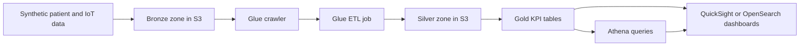

# Smart Healthcare AWS

This repository is a complete proof-of-concept for the Cloud Computing and Big Data S3 final project. It shows how a hospital consortium can turn synthetic patient and IoT data into analytics-ready dashboards using AWS Free Tier services.

## What This Project Does

The pipeline follows a simple hospital-analytics story:

1. Generate synthetic healthcare and device data.
2. Store the raw files in an S3 bronze zone.
3. Use AWS Glue to clean and standardize the data.
4. Write curated outputs to silver and gold zones.
5. Query the curated data with Athena.
6. Feed the results into a dashboard or reporting layer.

The repository includes both the cloud-oriented artifacts and local sample outputs so the project can be understood and demonstrated even without live AWS resources.

## Architecture Flow



This is the full movement of data through the project:

- raw records start as synthetic CSV or JSON files
- bronze stores the unprocessed source data
- Glue discovers the schema and prepares the data for analytics
- silver stores cleaned, typed, and partitioned records
- gold stores the final KPI tables for dashboards
- Athena runs SQL over the curated data
- dashboards turn the results into simple operational views

## End-to-End Flow

### 1. Data generation

The generator script creates three synthetic datasets:

- patient master data
- clinical encounter events
- IoT monitoring readings

These records are intentionally anonymized and deterministic so the project is safe to share and easy to reproduce.

What happens here:

- the generator creates repeatable sample patients
- the generator creates clinical events with wait time, occupancy, and vital-sign values
- the generator creates IoT readings for monitoring use cases
- the local sample files are written into the `data/` folder

### 2. Bronze zone

Raw CSV and JSON files land in the bronze zone first. This layer preserves source records with minimal processing.

What happens here:

- the raw files are uploaded to S3 without transformation
- the bronze zone acts as the system of record for the input data
- this keeps the original files available for debugging or reprocessing

### 3. Glue ingestion and ETL

The Glue crawler discovers schemas from the bronze files and publishes them to the Glue Data Catalog. The Glue ETL job then:

- reads the raw clinical events
- parses dates and casts numeric fields
- removes malformed or duplicate rows
- writes partitioned Parquet into the silver zone
- creates gold-zone KPI tables for reporting

What happens here:

- the crawler identifies columns and data types automatically
- the ETL job cleans the input rows so Athena can query them reliably
- partitioning by date and department makes queries faster and easier to organize
- the gold zone becomes the clean source used by the dashboard

### 4. Analytics layer

Athena reads the cataloged datasets and computes operational metrics such as:

- average wait time by department
- daily encounter volume
- occupancy pressure
- alert conditions for long queues

What happens here:

- SQL is used instead of application code for most reporting logic
- the same curated data can support multiple questions and reports
- the queries are easy to show in a lab, demo, or final presentation

### 5. Visualization and reporting

The gold-zone KPIs are ready for QuickSight or OpenSearch Dashboards. The sample documentation in this repo shows how to interpret those metrics and which tiles should appear on the dashboard.

What happens here:

- dashboard cards show the most important numbers first
- charts show trends over time and differences between departments
- alert views help staff focus on the departments with the longest waits

## Step-by-Step Project Walkthrough

Use this section when you want to explain the whole project from start to finish.

### Step 1: Create synthetic healthcare data

Run the generator script to create fake but realistic patient and IoT data. This makes the project privacy-safe and reproducible.

### Step 2: Save raw files in the bronze layer

The raw files are placed in S3 bronze storage so the project keeps an untouched copy of the input records.

### Step 3: Discover the schema with Glue

The Glue crawler scans the bronze data and registers the columns in the Glue Data Catalog. This is what lets Athena understand the tables.

### Step 4: Transform the data with Glue ETL

The Glue job cleans the clinical events, removes duplicates, converts the schema, and writes Parquet output into silver and gold zones.

### Step 5: Query the results in Athena

The Athena SQL files calculate wait-time trends, occupancy rates, and departmental workload. This is the analytics layer of the project.

### Step 6: Show the results in a dashboard

The dashboard turns the KPIs into simple visuals that hospital staff can understand quickly.

### Step 7: Review the sample report and insights

The supporting docs explain the metrics, the sample findings, and the optional AI extension.

### Step 8: Present the cloud version

For the AWS version, the same flow is repeated in the cloud using S3, Glue, Athena, and dashboard tools.

## Repository Contents

- [Architecture](docs/architecture.md)
- [Data Model](docs/data-model.md)
- [Implementation Guide](docs/implementation-guide.md)
- [Dashboard Summary](docs/dashboard-summary.md)
- [Sample Insights](docs/sample-insights.md)
- [Technical Report](docs/technical-report.md)
- [Optional AI Extension](docs/ai-extension.md)
- [Presentation Notes](docs/presentation-notes.md)
- [Final Review Checklist](docs/final-review-checklist.md)
- [Synthetic Data Generator](scripts/generate_synthetic_healthcare_data.py)
- [Analytics Demo](scripts/analytics_demo.py)
- [Validation Script](scripts/validate_outputs.py)
- [Glue ETL Job](glue_jobs/healthcare_etl_job.py)
- [Athena Queries](sql/athena_queries.sql)

## Project Structure

```text
docs/           Project write-up, deployment notes, and presentation support
glue_jobs/      AWS Glue ETL script for the cloud pipeline
scripts/        Local data generator, analytics demo, and validation utilities
sql/            Athena queries for the curated datasets
data/           Generated bronze, silver, and gold sample outputs
```

## Local Setup and Run Guide

Use this path if you want to explore the project on your machine without touching AWS.

### Prerequisites

- Python 3.12 or later
- Git
- No third-party Python packages are required for the local scripts

### Step 1: Generate the sample data

```bash
python scripts/generate_synthetic_healthcare_data.py
```

This creates the sample bronze, silver, and gold files under the data directory.

### Step 2: Inspect the analytics summary

```bash
python scripts/analytics_demo.py
```

This prints the KPI summary generated from the committed sample outputs.

### Step 3: Validate the generated outputs

```bash
python scripts/validate_outputs.py
```

This confirms that the sample data exists and that the gold-zone files contain the expected number of records.

### Step 4: Re-run with different sample sizes if needed

```bash
python scripts/generate_synthetic_healthcare_data.py --patients 24 --days 7 --seed 11
python scripts/analytics_demo.py
python scripts/validate_outputs.py
```

The generator accepts command-line arguments so you can create smaller or larger sample sets for demos.

## AWS Free Tier Deployment Guide

Use this path if you want to present the cloud workflow in AWS.

### Step 1: Create the S3 data lake

Create one S3 bucket and organize it into these prefixes:

- bronze for raw uploads
- silver for cleaned records
- gold for curated KPIs
- scripts for SQL and job artifacts

Suggested layout:

```text
s3://your-bucket/bronze/
s3://your-bucket/silver/
s3://your-bucket/gold/
s3://your-bucket/scripts/
```

### Step 2: Upload the raw data

Upload the generated CSV files from the bronze folder into the bronze prefix.

Suggested files:

- patients.csv
- clinical_events.csv
- iot_readings.csv

### Step 3: Create the Glue catalog and crawler

Create one Glue crawler to scan the bronze prefix and register the source tables in the Glue Data Catalog.

Important settings:

- use an IAM role with S3 read access
- point the crawler at the bronze prefix only
- keep the naming lowercase and simple

### Step 4: Run the Glue ETL job

Use the Glue script in [glue_jobs/healthcare_etl_job.py](glue_jobs/healthcare_etl_job.py) to clean and standardize the events.

The job performs these actions:

- reads the raw clinical events CSV from S3
- casts fields into clean types
- removes duplicate event IDs
- writes partitioned Parquet to silver and gold

### Step 5: Query with Athena

Create an Athena database and point it to the Glue Catalog tables.

Run the queries in [sql/athena_queries.sql](sql/athena_queries.sql) to produce department-level and day-level analytics.

### Step 6: Build the dashboard

Connect QuickSight or OpenSearch Dashboards to Athena or to the curated gold-zone output.

Recommended visual tiles:

- average wait time by department
- average occupancy by department
- daily encounter trend
- alert list for departments above the threshold

### Step 7: Present the result

Use the metrics in [docs/dashboard-summary.md](docs/dashboard-summary.md) and [docs/sample-insights.md](docs/sample-insights.md) to explain the outcome of the pipeline.

## Project Workflow in Plain Language

If you need to explain the project to someone new, use this summary:

1. We create fake but realistic healthcare data.
2. We store raw files in S3.
3. Glue cleans and organizes the data.
4. Athena queries the cleaned data.
5. Dashboards turn the numbers into operational insight.
6. The optional AI extension can predict or detect anomalies later.

## Key Files

- [Architecture](docs/architecture.md) shows the data flow.
- [Data Model](docs/data-model.md) explains the bronze, silver, and gold schemas.
- [Implementation Guide](docs/implementation-guide.md) gives the AWS execution order.
- [Technical Report](docs/technical-report.md) explains the design choices and limitations.
- [Final Review Checklist](docs/final-review-checklist.md) helps verify the submission before turning it in.

## Validation and Demo Commands

```bash
python scripts/generate_synthetic_healthcare_data.py
python scripts/analytics_demo.py
python scripts/validate_outputs.py
```

The committed sample data is already aligned with the validation script, so the repository can be reviewed immediately after cloning.

## Submission Checklist

- architecture diagram
- implementation guide
- demo script or notebook
- dashboard summary
- technical report
- final review checklist