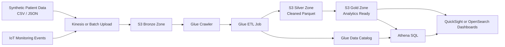

# Architecture

## Smart Hospital Operations Pipeline

## Design Notes

- Bronze stores raw source records with minimal changes.
- Silver contains standardized, validated, and typed records.
- Gold contains aggregated KPIs ready for dashboard consumption.
- Athena is used for serverless SQL analytics to stay within Free Tier constraints.
- Glue provides both schema discovery and ETL orchestration.

## Target Use Case

The POC focuses on a smart hospital operations dashboard that tracks:

- patient arrivals and admissions
- wait-time trends by department
- IoT vital-sign alerts
- occupancy pressure and utilization